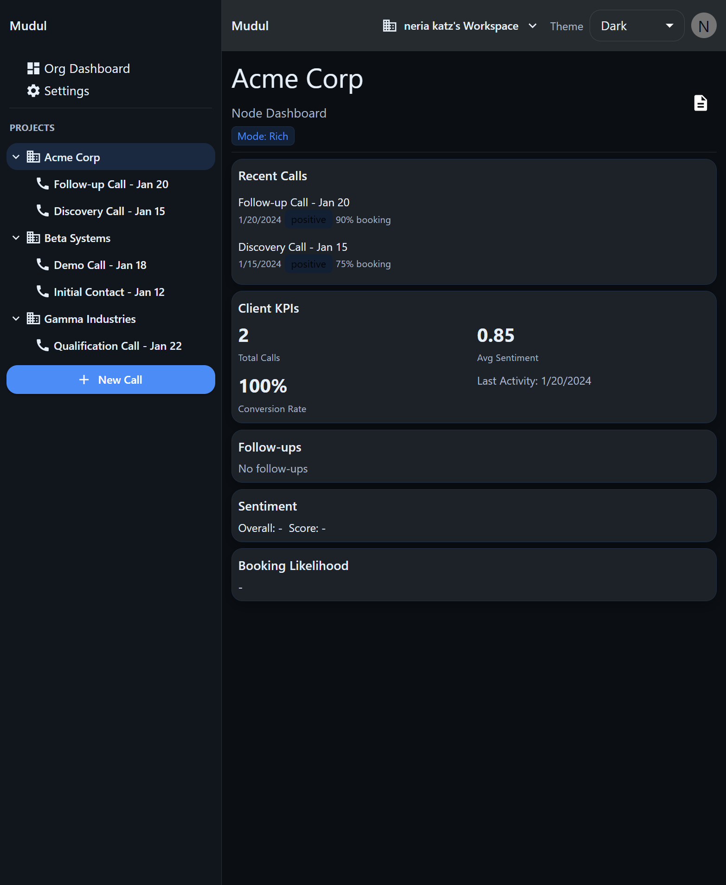
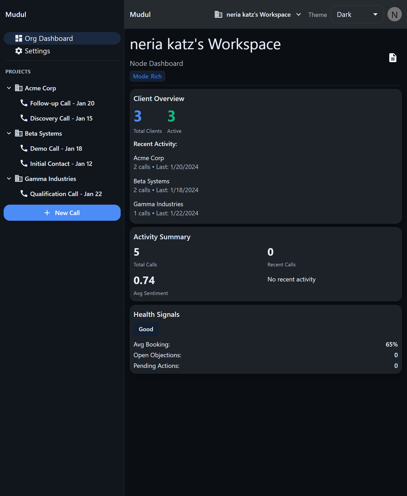
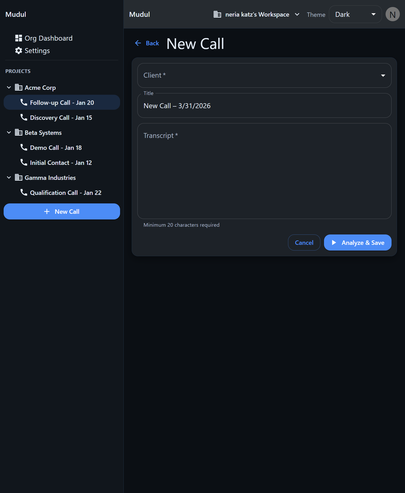
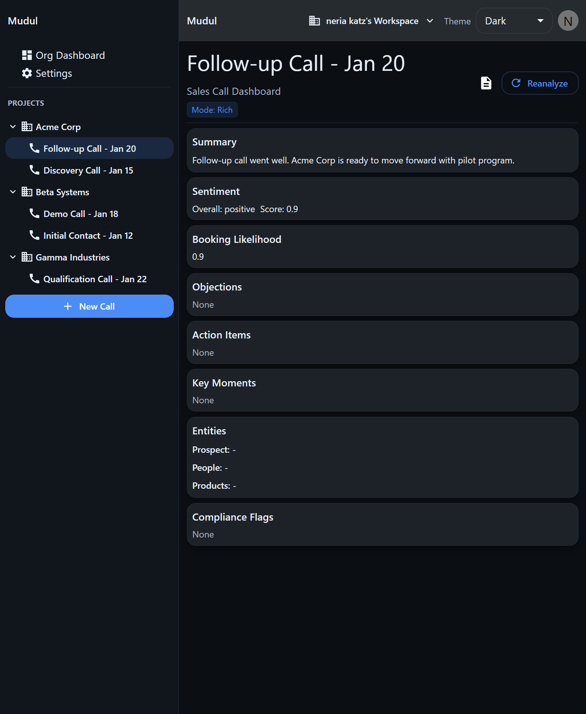

# Mudul - AI Client Intelligence Workbench (Monorepo)

A **protocol-first, modular system** for turning sales calls into structured, actionable client intelligence.

Built to ingest conversations, analyze them with LLMs, and continuously update client-level insights over time.

---

## Product Screens

<table>
  <tr>
    <td></td>
    <td></td>
  </tr>
  <tr>
    <td></td>
    <td></td>
  </tr>
</table>

---

## 🧠 What it does

- Upload call transcripts or notes
- Analyze content via LLMs (OpenAI / Anthropic)
- Extract structured insights:
  - Action items
  - Deal probability score
  - Key signals and risks
  - Summary insights
- Continuously update a **client-level dashboard**
- Aggregate insights across all clients into a **global view**

The system is designed around **strict JSON contracts**, so AI output is reliable, structured, and usable in the UI.

---

## 🏗️ Architecture (Monorepo)

- **`@core`** — Domain types, repositories, event system (framework-agnostic)
- **`@protocol`** — AI contracts (JSON schemas), validators, provider clients
- **`@storage`** — Persistence adapters (memory / Postgres / Firestore)
- **`@ui-headless`** — UI logic and widget contracts (DOM-agnostic)
- **`@ui-web`** — React renderers (thin adapters)
- **`apps/web`** — Web app shell (React + Tailwind)

---

## ⚡ Live AI Integration

Supports **real-time AI analysis** with strict validation and controlled execution.

### Configuration

```bash
export USE_LIVE_AI=true

export AI_PROVIDER=openai        # or "anthropic"
export AI_API_KEY=sk-proj-...
export AI_MODEL=gpt-4o-mini
export AI_TIMEOUT_MS=30000
export AI_MAX_TOKENS=1500
````

---

## 🔒 Security & Reliability

* Server-only AI execution (never exposed to client)
* No API key leakage
* Schema validation (Zod) for all AI responses
* Deterministic outputs (temperature=0)
* Idempotent processing via SHA-256 hashing
* Safe fallback to mock provider in development

---

## 🔁 Data Flow

```
Client Input (call transcript)
   → Server (Vite middleware)
   → AI Provider
   → JSON Schema Validation
   → Persisted Insights
   → UI (client + global dashboards)
```

---

## 🧠 Key Design Principles

* **Protocol-first** — AI is treated as a structured system, not free text
* **Deterministic outputs** — predictable, machine-readable responses
* **Composable architecture** — clear separation between logic, UI, and AI layer
* **Extensibility** — easy to plug new providers, storage layers, or UI renderers

---

## 🚧 Next Step (In Progress)

Introduce **persistent client memory**, allowing the system to:

* Accumulate context across multiple calls
* Refine insights over time
* Improve scoring and recommendations based on history

---

## 🧪 Development

```bash
pnpm install
pnpm dev
pnpm build
```

