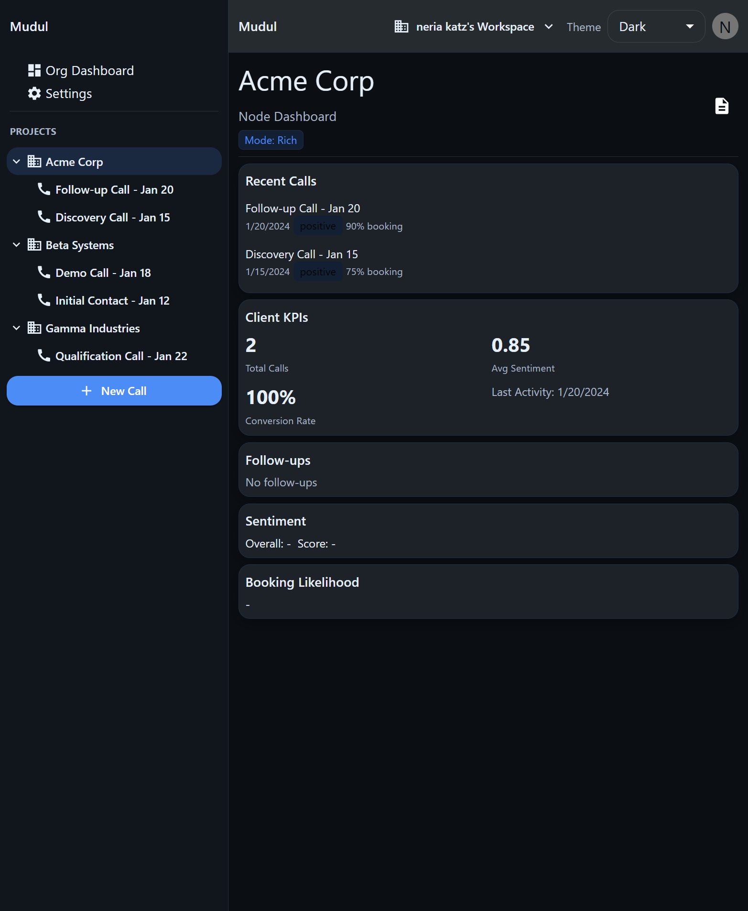
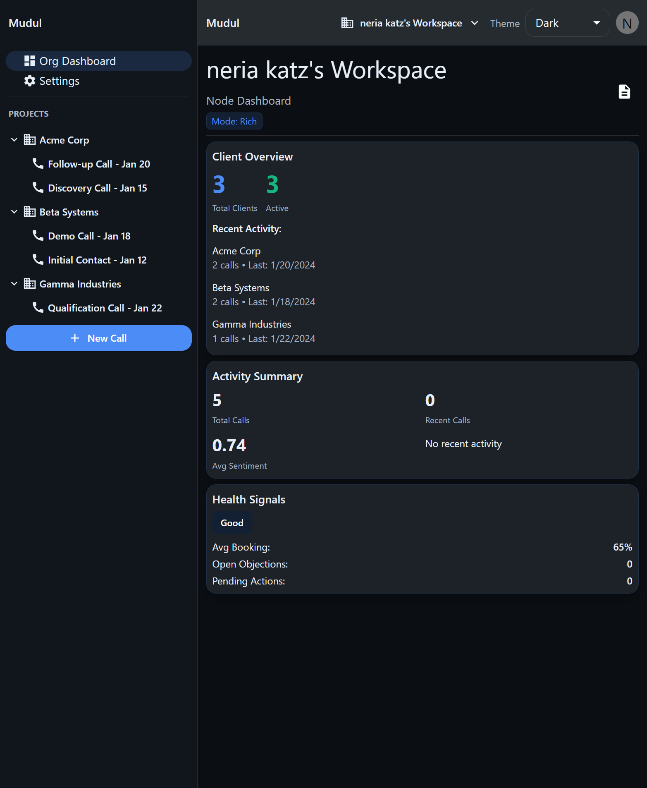
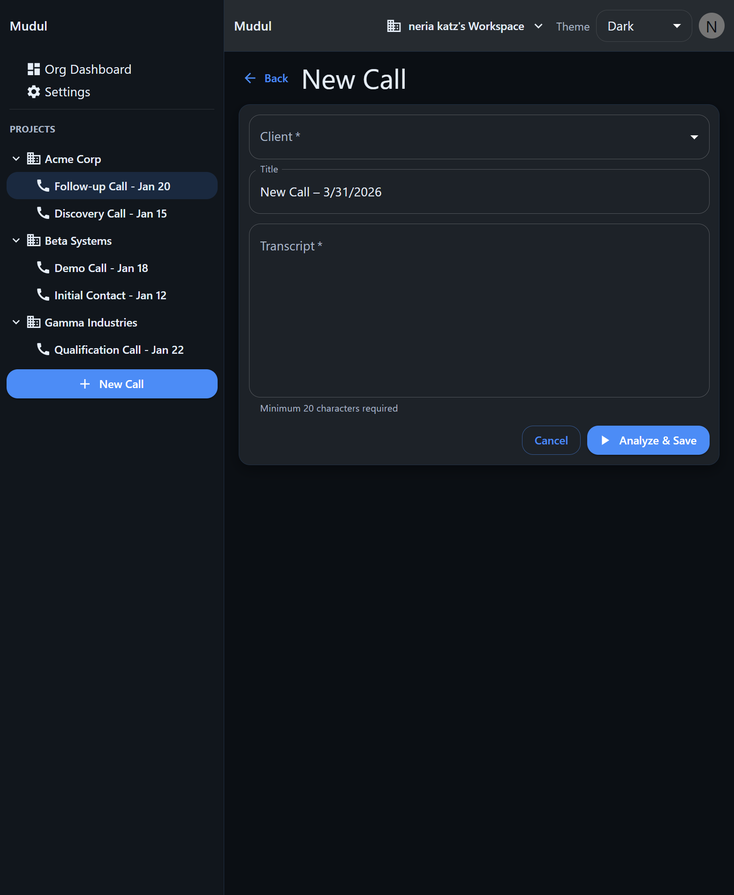
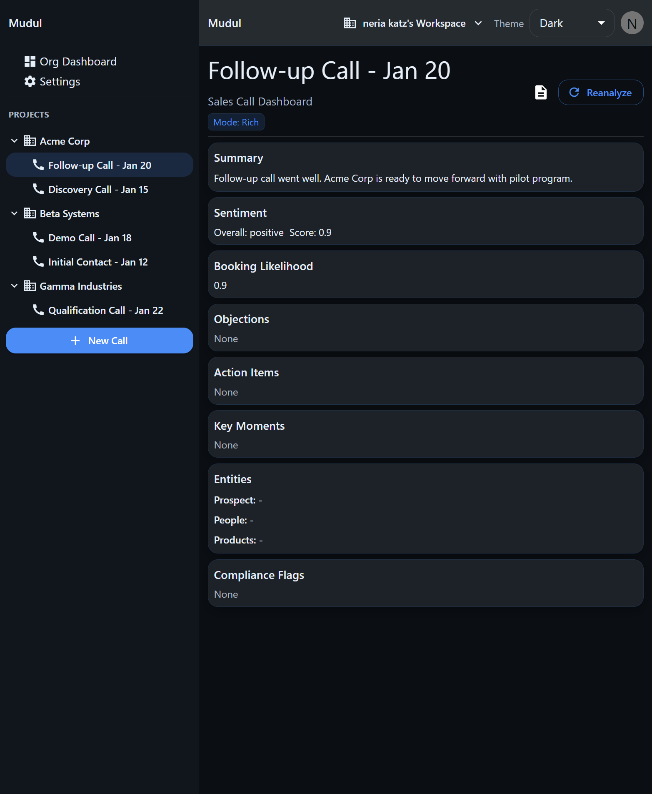

# Mudul

Mudul is an AI Client Intelligence Workbench: a protocol-first monorepo for turning raw sales call transcripts into structured, actionable client intelligence.

This repository is a product prototype and workflow exploration, not a finished SaaS product. The focus is on how AI output gets constrained, validated, stored, and turned into useful dashboards instead of staying as a one-off summary.

## What it does

- Accepts a new call transcript or notes input
- Sends the transcript through a server-side AI analysis step
- Validates the response against structured JSON contracts
- Persists usable outputs such as summaries, objections, action items, entities, and sentiment
- Surfaces the results in client-level and org-level dashboard views

## Main workflow

1. A user adds a call transcript.
2. The server routes it into a mock or live AI provider flow.
3. The response is normalized into a strict schema.
4. Structured analysis is stored with call metadata.
5. Dashboards update at the call, client, and organization levels.

## Product screens

<table>
  <tr>
    <td></td>
    <td></td>
  </tr>
  <tr>
    <td></td>
    <td></td>
  </tr>
</table>

## Monorepo architecture

- `@mudul/core`: domain types, repositories, seed/demo data, and shared analysis logic
- `@mudul/protocol`: AI contracts, prompt assets, JSON schemas, and validators
- `@mudul/storage`: persistence adapters and database setup
- `@mudul/ui-headless`: UI contracts intended to stay renderer-agnostic
- `@mudul/ui-web`: thin web renderers and UI composition helpers
- `apps/web`: the prototype web app, API routes, auth flow, and dashboard screens

See [docs/architecture.md](docs/architecture.md) for layer boundaries and import direction.

## AI analysis model

Mudul treats AI as a structured subsystem rather than a chat surface:

- AI runs server-side only
- provider output is expected to match a schema
- malformed responses can be rejected or downgraded safely
- mock and fallback modes make the workflow testable without live credentials

This makes it easier to turn model output into product state instead of manually reviewing free text after every call.

## Current state

- The web app, transcript submission flow, and dashboard UI are implemented
- The repository supports both mock and live-provider analysis paths
- Seed/demo data is included for local exploration and demos
- Some infrastructure paths still mix prototype shortcuts with production-oriented patterns
- Persistent multi-call memory is a direction, not a completed feature

## Development

```bash
pnpm install
pnpm --filter web dev
pnpm --filter web build
```

## Environment

Use the root [`.env.example`](.env.example) or the package-specific examples as templates for local setup. Keep real credentials in local `.env` files only.
